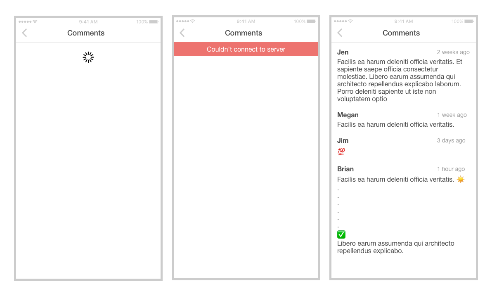
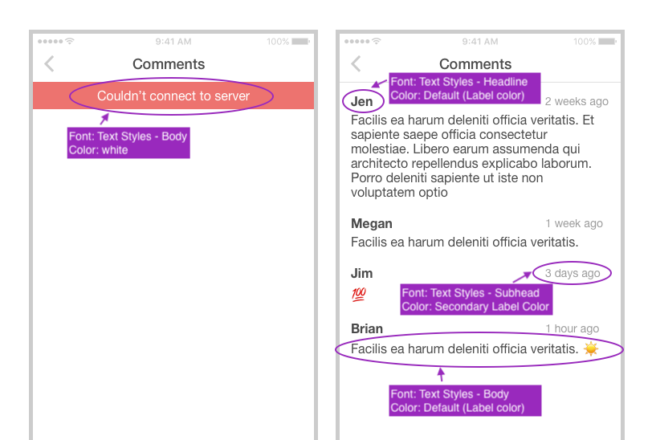

# The Image Comments Challenge - iOSLeadEssentials.com

 

It’s time to put your development skills to the test! 

You are called to add a new feature to the Feed App: displaying image comments when a user taps on an image in the feed.

The goal is to implement this feature using what you learned in the program.

You'll develop the API, Presentation, UI, and Composition for the 'Image Comments' feature.

*Important: There's no need to cache comments.*

*Important: As a **minimum requirement** to take this challenge, you must have seen the live lectures #001 until #004.*

---

## Your challenge

1) Display a list of comments when the user taps on an image in the feed.

2) Loading the comments can fail, so you must handle the UI states accordingly. 
	
	- Show a loading spinner while loading the comments.
		
		- If it fails to load: Show an error message.
		
		- If it loads successfully: Show all loaded comments in the order they were returned by the remote API.

3) The loading should start automatically when the user navigates to the screen.
	
	- The user should also be able to reload the comments manually (Pull-to-refresh).

4) At all times, the user should have a back button to return to the feed screen.
	
	- Cancel any running comments API requests when the user navigates back.
	
		- Important: Only cancel when the scene has been deallocated.
		
		- **Don't** cancel the request on `viewWillDisappear`/`viewDidDisappear` because it doesn't mean the view has been deallocated (the view may appear again!).

5) The comments screen layout should match the UI specs.
	
	- Present the comment date using relative date formatting, e.g., "1 day ago."

6) The comments screen title should be localized in all languages supported in the project.

7) The comments screen should support:
	- Light and Dark Mode
	- Dynamic Type (Scalable font sizes based on the user preference)

8) Write tests to validate your implementation, including unit, integration, and snapshot tests (aim to write the test first!).

9) Follow the specs below and test-drive this feature from scratch:


---


## API Specs

### Feed Image Comment

| Property          | Type                    |
|-------------------|-------------------------|
| `id`              | `UUID`                  |
| `message` 	    | `String`			      |
| `created_at`      | `Date` (ISO8601 String) |
| `author` 			| `CommentAuthorObject`   |

### Feed Image Comment Author

| Property          | Type                |
|-------------------|---------------------|
| `username` 	    | `String`			  |

### Payload contract

```
GET /image/{image-id}/comments

2xx RESPONSE (**Important**: any 2xx response is valid - not only 200!)

{
	"items": [
		{
			"id": "a UUID",
			"message": "a message",
			"created_at": "2020-05-20T11:24:59+0000",
			"author": {
				"username": "a username"
			}
		},
		{
			"id": "another UUID",
			"message": "another message",
			"created_at": "2020-05-19T14:23:53+0000",
			"author": {
				"username": "another username"
			}
		},
		...
	]
}
```

#### Base URL

https://ile-api.essentialdeveloper.com/essential-feed

#### Feed URL

Base URL + /v1/feed

https://ile-api.essentialdeveloper.com/essential-feed/v1/feed

#### Image Comments URL

Base URL + /v1/image/{image-id}/comments

https://ile-api.essentialdeveloper.com/essential-feed/v1/image/{image-id}/comments


---


## UI Specs

Follow the UI specs for loading, error, and success states:






---

## BDD Specs

### Story: Image Comments

### Narrative

```
As an online customer
I want the app to load image commments
So I can see how people are engaging with images in my feed
```

#### Scenarios (Acceptance criteria)

```
Given the customer has connectivity
 When the customer requests to see comments on an image
 Then the app should display all comments for that image
```

```
Given the customer doesn't have connectivity
 When the customer requests to see comments on an image
 Then the app should display an error message
```

## Use Cases

### Load Image Comments From Remote Use Case

#### Data:
- ImageID

#### Primary course (happy path):
1. Execute "Load Image Comments" command with above data.
2. System loads data from remote service.
3. System validates data.
4. System creates comments from valid data.
5. System delivers comments.

#### Invalid data – error course (sad path):
1. System delivers invalid data error.

#### No connectivity – error course (sad path):
1. System delivers connectivity error.


---


## Instructions

1) Fork the latest version of this repository. Here's <a href="https://guides.github.com/activities/forking" target="_blank">how forking works</a>.

2) Open the `EssentialApp/EssentialApp.xcworkspace` on Xcode 12.5.
	
	- Older Xcode versions are not supported.
	
	- Challenges submitted with branches other than `xcode12_5` will be rejected.

	- ⚠️ Important: ***Different simulators may generate slightly different snapshots (even if they look the same!).*** So you must run the snapshot tests using the exact same simulator used to take the snapshots:

		- iPhone 12 - iOS 14.5

	- Do not change the indentation in the project.

	- Do not rename the existing classes and files.

	- Important: Every time you build the project, it'll automatically reformat the modified files with SwiftFormat to maintain the code consistent.

3) You need to implement the API, Presentation, UI, and Composition for the Image Comments feature.

	- API:
		- Create a Test file: EssentialFeedTests/ImageComments/API/ImageCommentsMapperTests.swift
	
		- Create a Prod file: EssentialFeed/ImageComments/API/ImageCommentsMapper.swift
	
		- Test-drive the ImageCommentsMapper following the API specs above. 
			- Look at the Feed API tests and implementation as a guide.

	- Presentation: 
		- Create a Test file: EssentialFeedTests/ImageComments/Presentation/ImageCommentsPresenterTests.swift
	
		- Create a Prod file: EssentialFeed/ImageComments/Presentation/ImageCommentsPresenter.swift
	
		- Create a strings file: EssentialFeed/ImageComments/Presentation/ImageComments.string

		- Test-drive the ImageCommentsPresenter following the Presentation specs.
			- Look at the Feed Presentation tests and implementation as a guide.

		- Create EssentialFeed/ImageComments/Presentation/ImageCommentsLocalizationTests.swift to ensure the ImageComments.string file supports all localizations in the project.

	- UI
		- Create a Test file: EssentialFeediOSTests/ImageComments UI/ImageCommentsSnapshotTests.swift

		- Create a Prod file: EssentialFeediOS/ImageComments UI/Controllers/ImageCommentCellController.swift
	
		- Create a Prod file: EssentialFeediOS/ImageComments UI/Views/ImageComments.storyboard
	
		- Test-drive the ImageCommentCellController with snapshot tests following the UI specs.
			- Look at the Feed UI tests and implementation as a guide.

	- Comments UI Composer
 		- Create a Test file: EssentialAppTests/ImageCommentsUIIntegrationTests.swift

		- Create a Prod file: EssentialApp/CommentsUIComposer.swift
		
		- Test-drive the CommentsUIComposer implementation with integration tests.
			- Look at the Feed UI integration tests and FeedUIComposer implementation as a guide.

	- Composition
 		- Open the EssentialAppTests/FeedAcceptanceTests.swift

		- Test-drive the composition with an acceptance test (select an image in the list and check the comments view was shown on screen with the expect comments).
			- The composition must be implemented in the `SceneDelegate.showComments()` method.

			- Look at the Feed acceptance tests and implementation as a guide.

4) You can see/interact with your solution by running the Application on the simulator (or device). 
	- Switch to the `EssentialApp` scheme and press CMD+R.

5) Errors should be handled accordingly.

	- There shouldn't be *any* `fatalError` in production code.

	- There shouldn't be empty `catch` blocks.

	- There shouldn't be any `print` statements, such as `print(error)`.

6) When all tests are passing and you're done implementing your solution:

	- Review your code and make sure it follows **all** the instructions above.

		- If it doesn't, make the appropriate changes, push, and review your code again.

	- If it does, create a Pull Request from your branch to the main challenge repo's matching branch.

		- For example, if you implemented the challenge using the `xcode12_5` branch, your PR should be from your fork's `xcode12_5` branch into the main repo's `xcode12_5` branch (DO NOT MIX Xcode versions or you'll have merge conflicts!).

	- The title of the Pull Request should be: **Your Name - Image Comments Challenge**

7) We'll review your Pull Request and approve it or request any changes required with detailed feedback.


---


## Guidelines


1) Aim to commit your changes every time you add/alter the behavior of your system or refactor your code.

2) Aim for descriptive commit messages that clarify the intent of your contribution which will help other developers understand your train of thought and purpose of changes.

3) The system should always be in a green state, meaning that in each commit all tests should be passing.

4) The project should build without warnings.

5) The code should be carefully organized and easy to read (e.g. indentation must be consistent).

6) Make careful and proper use of access control, marking as `private` any implementation details that aren’t referenced from other external components.

7) Aim to write self-documenting code by providing context and detail when naming your components, avoiding explanations in comments.

Happy coding!
